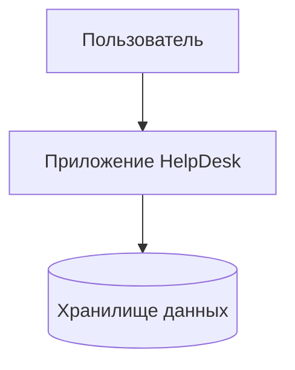
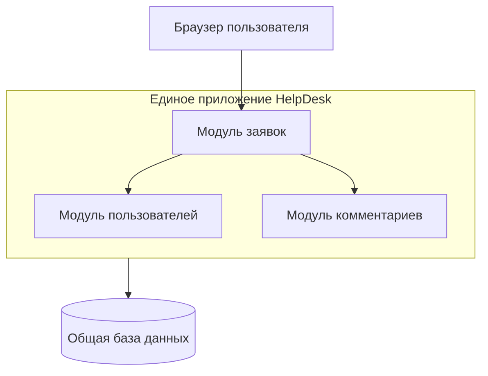
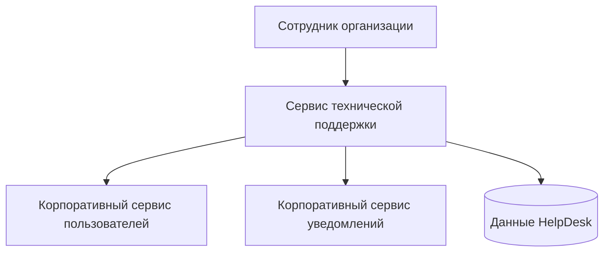

# Архитектурные подходы HelpDesk

## Общая структура системы

```mermaid
flowchart TD
    User["Пользователь"]
    App["Приложение HelpDesk"]
    Storage[("Хранилище данных")]

    User --> App
    App --> Storage
```

## Монолитная архитектура

```mermaid
flowchart TD
    Browser["Браузер пользователя"]

    subgraph Monolith["Единое приложение HelpDesk"]
        Users["Модуль пользователей"]
        Tickets["Модуль заявок"]
        Comments["Модуль комментариев"]

        Tickets --> Users
        Tickets --> Comments
    end

    DB[("Общая база данных")]

    Browser --> Tickets
    Monolith --> DB
```

## Сервис-ориентированная архитектура SOA

```mermaid
flowchart TD
    Employee["Сотрудник организации"]

    HelpDesk["Сервис технической поддержки"]
    Directory["Корпоративный сервис пользователей"]
    Notifications["Корпоративный сервис уведомлений"]

    DB[("Данные HelpDesk")]

    Employee --> HelpDesk

    HelpDesk --> Directory
    HelpDesk --> Notifications
    HelpDesk --> DB
```
